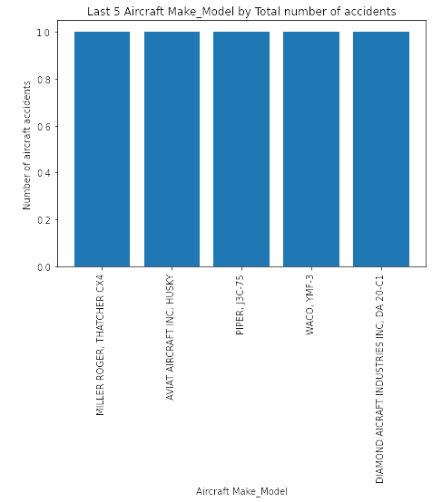
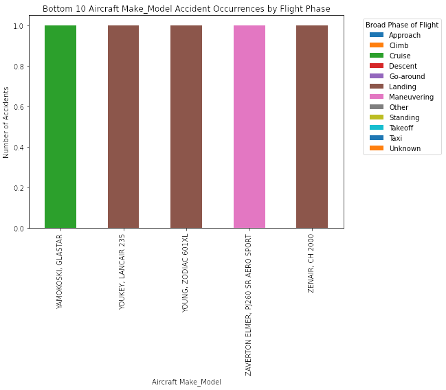
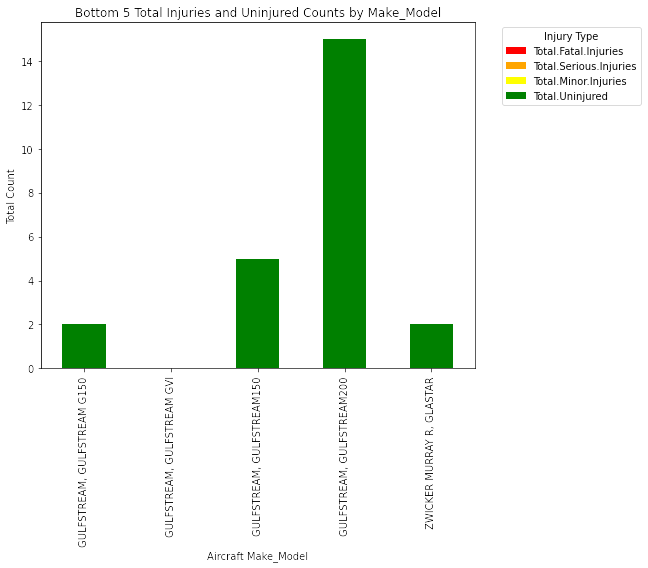
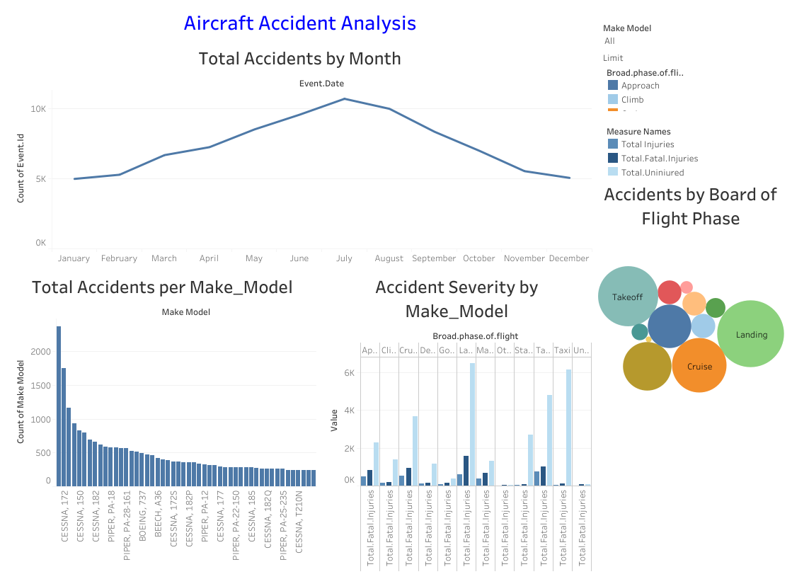

# Aviation Accidents Analysis
## Overview
This project analyzes aviation accident data from 1948 to 2022 involving civil aviation accidents and selected incidents in the United States and international waters. Descriptibe analysis of the aviation accidents data shows that accidents occurence vary across different models and that number of accidents vary across flight phases. The company can use this analysis to determine lowest risk aircraft best suited for purchase and ensure efficient business operations.
## Business Problem
The company is venturing into the aviation industry to diversify its portfolio, focusing on purchasing and operating airplanes for both commercial and private enterprises. The company, however, lacks knowledge about the potential risks associated with different aircraft types.This data analysis aims to tackle the primary objective which is to identify the lowest-risk aircraft that can be purchased by the company for the business operations. This analysis helps the company evaluate the aircraft best suited in terms of safety assuarance, operations reliablity and efficiency and cost and reputation management as it enters this new market.
## Data
The data source of this analysis is pulled from the National Transportation Safety Board that contains aviation accident data from 1948 to 2022  in the United States and international waters. Each accident event in the data has features giving details of each accident occurenece (e.g aircraft model,make, weather condition, event date e.t.c). 
## Methods
This project utilizes descriptive analysis. It provides an overview of the accident occurence to determine which aircrafts have the lowest risk providing higher safety assurance hence best suited for the company operations. It considers accident occurrence by Make_model, by flight phase and severity per Make_model. There is use of barcharts to visualize these factors.
## Results
(MILLER ROGER, THATCHER CX4), (AVIAT AIRCRAFT INC, HUSKY), (PIPER, J3C-75), (WACO, YMF-3), (DIAMOND AICRAFT INDUSTRIES INC, DA 20-C1) aircraft make_models have the lowest accident occurrence and hence would be suitable for consideration for purchase and operations of the company.

Based on accident occurrence by Flight Phase per model, aircraft make_models with the lowest number of accidents are more suitable. They include (YAMOKOSKI, GLASTAR),( YOUKEY, LANCAIR 235), (YOUNG, ZODIAC 601XL),(ZAVERTON ELMER, PJ260 SR AERO SPORT), (ZENAIR, CH 2000).

Based on severity of the accident then the most suitable make_models would be (GULFSTREAM, GULFSTREAM G150), (GULFSTREAM, GULFSTREAM GVI), (GULFSTREAM, GULFSTREAM150), (GULFSTREAM, GULFSTREAM200), (ZWICKER MURRAY R, GLASTAR') as the have no injured counts and high uninjured counts. 

## Conclusion
This analysis leads to three recommendations for the best suited aircraft for the company to select:

1.Select from the airplane models with lowest number of accident occurrence. From the analysis, each Make_Model varies in number of accidents occurrence. Therefore, the best airplanes to select are from the Make_Models recording the lowest accident number as they provide a higher safety assuurance. The top five these Make_Model include: (MILLER ROGER, THATCHER CX4), (AVIAT AIRCRAFT INC, HUSKY), (PIPER, J3C-75), (WACO, YMF-3), (DIAMOND AICRAFT INDUSTRIES INC, DA 20-C1).

2.Choosing airplane models with lowest accident occurrence in each flight phase. From the analysis, the number of aviation accidents differs for each flight phase. Hence, models with the lowest accident occurrence in each flight phase should be selected for operations as they provide a higher guarantee of safety and smooth operations of the aircraft throughout the flight. This provides a better guarantee to the company for efficient and effective operations of the new division. Based on this, the best airplane Make_models are (YAMOKOSKI, GLASTAR),( YOUKEY, LANCAIR 235), (YOUNG, ZODIAC 601XL),(ZAVERTON ELMER, PJ260 SR AERO SPORT), (ZENAIR, CH 2000).

3.Airplane Make_models recording the lowest number of fatalities and injuries and highest number of uninjured is best suited for the company as they provide less risk and are likely more reputable amongst the public. Therefore, will be more attractive to the target customers. Based on this criteria the best suited Make_models are (GULFSTREAM, GULFSTREAM G150), (GULFSTREAM, GULFSTREAM GVI), (GULFSTREAM, GULFSTREAM150), (GULFSTREAM, GULFSTREAM200), (ZWICKER MURRAY R, GLASTAR').The company should focus on equiping these aircrafts with better safety equipements to boost operations and reduce fatalities.  
 

## Further Analysis
Further analysis could give more insights on other ways to best select aircrafts best suited for the company's new aviation division:

1.Prediction of accidents based on weather conditions. This investigates the impact of  weather conditions to the occurrence of aviation accidents.

2.Model need of frequency of accident occurrence by location. This could predict aircraft accident prone locations.

3.Aircraft maintenance influence on aviation accident rates. This analyzes how the level of maintenance of the aircraft impacts accident rates.

## For More Information

See the full analysis [Jupyter Notebook](Aviation-Accidents-Analysis.ipynb)  or review the  [Presentation](Aircraft.Accidents.Project.Presentation.pdf)

## Dashboard

View the interactive [Tableau Dashboard](https://public.tableau.com/app/profile/maureen.wambugu/viz/Aircraft_Accidents_Analysis_2024_MW/AircraftAccidentAnalysis?publish=yes) for detailed insights.

